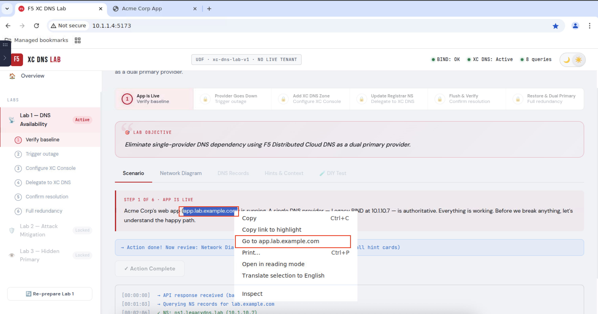
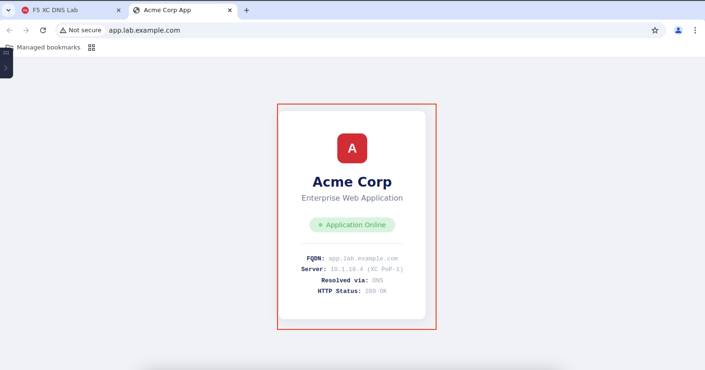

# F5 Distributed Cloud DNS - Lab Guide

## 📋 Lab Information

| Item | Details |
|------|---------|
| **Course** | F5 Distributed Cloud DNS Training |
| **Lab Environment** | Kasm Workspaces (Container Streaming Platform) |
| **UDF Environment** | xc-dns-lab-v1 |
| **Requirements** | NO LIVE TENANT REQUIRED |

### 💡 Why No Live Tenant Required?

This lab uses a **fully simulated F5 XC DNS environment** that provides the same hands-on experience as a live tenant:

- **Realistic XC Console Interface** — The lab replicates the actual F5 Distributed Cloud Console UI, so you learn the real workflow and navigation.
- **Simulated DNS Infrastructure** — All DNS operations (zone creation, record management, NS delegation) behave exactly like production.
- **Safe Learning Environment** — Make mistakes without affecting real infrastructure. Reset and retry anytime.
- **No Account Setup Required** — Jump straight into learning without waiting for tenant provisioning or API credentials.
- **Consistent Experience** — Every participant gets the same pre-configured environment, ensuring predictable lab outcomes.

> **🎯 Result:** You gain practical XC DNS skills that directly transfer to real-world deployments — without the complexity of managing a live tenant during training.

---

## 🎯 Lab Objectives

Learn how to use F5 Distributed Cloud DNS through hands-on labs covering:
- DNS Availability
- DNS Security
- Infrastructure Protection

> **Note:** This lab does not require CLI - all tasks are performed via Web Interface.

---

## 🔬 Lab Series Overview

| Lab | Topic | Description | Status |
|-----|-------|-------------|--------|
| **Lab 1** | DNS Availability | Eliminate single-provider DNS dependency using F5 Distributed Cloud DNS as a dual primary provider | 🔓 Active |
| **Lab 2** | Attack Mitigation | XC DNS doesn't just serve DNS — it absorbs DDoS attacks. Watch a live flood get mitigated in real time | 🔒 Locked |
| **Lab 3** | Hidden Primary | The attacker cannot target what they cannot find. Hide BIND behind XC DNS for maximum protection | 🔒 Locked |

### 🔒 Why are Lab 2 and Lab 3 locked?

Labs are designed to be completed **sequentially**. Each lab builds upon the configuration and knowledge from the previous lab:

- **Lab 2 (Attack Mitigation)** requires the XC DNS zone and dual primary setup from Lab 1 to demonstrate how XC DNS absorbs DDoS attacks while Legacy BIND would be overwhelmed.

- **Lab 3 (Hidden Primary)** requires understanding of both DNS availability (Lab 1) and attack mitigation (Lab 2) to implement the hidden primary architecture where BIND is completely invisible to attackers.

> **💡 Tip:** Complete Lab 1 first, then Lab 2 and Lab 3 will automatically unlock.

---

## 🖥️ Kasm Workspaces Overview

Before starting the DNS lab, let's get familiar with the Kasm Workspaces environment.

### Login to Kasm Workspaces

1. Open your web browser and navigate to the Kasm Workspaces URL provided by your instructor.

2. You will see the **Kasm Workspaces Login** page. Locate the **Login form** on the left side of the screen (highlighted in the red box) which contains:
   - **Email** field
   - **Password** field
   - **Login** button


3. Enter your credentials in the **Login form** (highlighted in the red box):
   - **Email:** `user@kasm.local` (or the email provided by your instructor)
   - **Password:** Password provided by your instructor

4. Click the **Login** button to proceed.


---

### Launching Chrome Browser

After logging in, you will see the Kasm desktop with available applications.

1. You will see the Kasm desktop. Click on **Chrome** (highlighted in the red box) to select it.


2. A **Launch Chrome** dialog will appear. Ensure **"New Tab"** is selected in the dropdown (highlighted in the red box), then click the **"Launch Session"** button (highlighted in the red box) to start Chrome.


3. Chrome browser will open. You will see **Managed Bookmarks** on the left side of the bookmarks bar (highlighted in the red box). Click on **"F5 XC DNS Lab"** bookmark to access the lab.


---

### Launching a Terminal (Optional)

If you need to use the Terminal:

1. To open the Kasm panel, click the small icon on the left side of the screen (highlighted in the red box).


2. Click the **"Workspaces"** button (highlighted in the red box) to start the terminal..


3. From the Kasm Workspaces, click on **Terminal** (highlighted in the red box) to select it.


4. A **Launch Terminal** dialog will appear. You can choose where to open the session by clicking the dropdown arrow (highlighted as **1** in the red box), then select **"New Tab"** (highlighted as **2** in the red box)


---

### Launching Terminal Session

1. Click the **"Launch Session"** button (highlighted in the red box) to start the terminal.


### Switching Between Chrome and Terminal

You can use the browser tabs to switch between **Chrome** and **Terminal** sessions (highlighted in the red box).


---

## 📝 Lab Instructions

### Step 1: Navigate to F5 XC DNS Lab Series

1. The browser will open the **F5 XC DNS Lab Series** page at URL: `http://10.1.1.4:5173`

2. Verify the Lab status by checking the **Lab Ready** indicator in the top right corner.

3. Click the **"Start Lab 1 — DNS Availability"** button (highlighted in the red box) to begin the lab.


---

### Step 2: Begin Lab 1 - DNS Availability

#### 📌 Lab Objective
> Eliminate single-provider DNS dependency using F5 Distributed Cloud DNS as a dual primary provider.

#### Lab Status Indicators (Top Right):
- **BIND:** OK ✅
- **XC DNS:** Active ✅
- **Queries:** 0

#### Lab 1 Steps Overview (6 Steps):

| Step | Name | Description |
|------|------|-------------|
| 1 | **App is Live** | Verify baseline |
| 2 | **Provider Goes Down** | Trigger outage |
| 3 | **Add XC DNS Zone** | Configure XC Console |
| 4 | **Update Registrar NS** | Delegate to XC DNS |
| 5 | **Flush & Verify** | Confirm resolution |
| 6 | **Restore & Dual Primary** | Full redundancy |

#### Step 1 of 6: App is Live

**Scenario:**
> Acme Corp's web app (app.lab.example.com) is running. A single DNS provider — Legacy BIND at 10.1.10.7 — is authoritative. Everything is working. Before we break anything, let's understand the happy path.

The lab interface provides multiple **tabs** for additional information (highlighted in the red box):
- **Scenario** - Current scenario description
- **Network Diagram** - Network topology visualization
- **DNS Records** - DNS record details
- **Hints & Context** - Helpful hints for completing the lab
- **DIY Test** - Self-testing section


---

### Step 3: Run DNS Baseline Check

1. In the **Scenario** tab, you will see the current step **"STEP 1 OF 6 - APP IS LIVE"**. Click the **"Run DNS Baseline Check"** button (highlighted in the red box) to verify the baseline.


2. After the baseline check completes, you will see the verification results with **"Action done!"** message (highlighted in the red box).


---

### Step 3a: Verify App Status via Browser (Optional)

You can verify that the Acme Corp web application is running by opening it directly in your browser:

1. In the **Action done!** results, you will see the URL **`http://app.lab.example.com`** (highlighted in the red box).

2. **Right-click** on the URL and select **"Open link in new tab"** (highlighted in the red box) to open the application in a new browser tab.



3. A new browser tab will open showing the **Acme Corp Enterprise Web Application** page. This confirms that:
   - DNS resolution is working correctly
   - The web application is accessible
   - Legacy BIND (10.1.10.7) is serving DNS queries properly

**Application Details:**
- **App:** Acme Corp Enterprise Web Application
- **FQDN:** app.lab.example.com
- **Resolved via:** Legacy BIND DNS (10.1.10.7)
- **HTTP Status:** 200 OK



> **💡 Tip:** Keep this tab open to monitor the application status throughout the lab. You'll see how DNS changes affect application accessibility.

---

### Step 4: Explore Lab Interface Tabs

The lab interface provides several tabs to help you understand the environment:

#### Network Diagram Tab

Click on the **"Network Diagram"** tab (highlighted in the red box) to view the network topology:
- **CLIENT VM** (10.1.10.9) → DNS query → **REGISTRAR** (10.1.10.8) → NS lookup → **LEGACY BIND** (10.1.10.7) → A record → **APP SERVER** (10.1.10.4)


#### DNS Records Tab

Click on the **"DNS Records"** tab (highlighted in the red box) to view current DNS records:

| Name | Type | Value | TTL | Source |
|------|------|-------|-----|--------|
| lab.example.com | NS | ns1.legacydns.lab | 86400 | Registrar |
| app.lab.example.com | A | 10.1.10.4 | 10 | Legacy BIND |


#### Hints & Context Tab

Click on the **"Hints & Context"** tab (highlighted in the red box) to get helpful information:
- **What just happened?** - Explanation of the DNS lookup process
- **Why does this matter?** - Understanding the importance
- **Want to go deeper?** - Additional learning resources


#### DIY Test Tab

Click on the **"DIY Test"** tab (highlighted in the red box) to run manual tests from the terminal.


---

### Step 5: DIY Testing (Optional)

You can manually verify the DNS configuration using the Terminal:

1. In the **DIY Test** tab, you will see several commands. Click the **"Copy"** button (highlighted in the red box) to copy a command.

2. Switch to the **Terminal** tab (highlighted in the red box) in your browser.


3. Right-click in the terminal and select **"Paste"** (highlighted in the red box) to paste the command.


4. Press **Enter** to run the command. You will see the output showing the DNS resolution results:

```bash
$ dig @10.1.10.7 app.lab.example.com A +short
10.1.10.4

$ dig @10.1.10.8 lab.example.com NS +short
ns1.legacydns.lab.

$ curl -s -o /dev/null -w "HTTP %{http_code}\n" http://app.lab.example.com
HTTP 200
```


5. After completing the DIY test, you will see **"Action done!"** message (highlighted in the red box) confirming the test results.


---

### Step 6: Trigger DNS Provider Outage (Step 2 of 6)

Now we will simulate a DNS provider outage to understand the impact of single-provider dependency.

1. Click on **"Provider Goes Down"** in the progress bar or **"Trigger DNS Prodiver outage"** in the left navigation (highlighted in the red box). Then click the **"Trigger DNS Provider Outage"** button to simulate the outage.


2. After triggering the outage, you will see the **"Action done!"** message (highlighted in the red box) showing:
   - Legacy BIND is down - DNS resolution failing
   - App UNREACHABLE - DNS resolution failed


---

### Step 7: Explore Outage Impact

Explore the tabs to understand what happened during the outage:

#### Network Diagram Tab (Outage State)

Click on the **"Network Diagram"** tab (highlighted in the red box) to view the network topology during outage:
- **CLIENT VM** (10.1.10.9) → DNS query → **REGISTRAR** (10.1.10.8) → timeout ✗ → **LEGACY BIND** (10.1.10.7) is DOWN
- **APP SERVER** (10.1.10.4) is unreachable


#### DNS Records Tab (Outage State)

Click on the **"DNS Records"** tab (highlighted in the red box) to view DNS records status:
- **Legacy BIND × DOWN** - The DNS provider is no longer responding


#### Hints & Context Tab (Outage State)

Click on the **"Hints & Context"** tab (highlighted in the red box) to understand:
- **What just happened?** - Legacy BIND's cloud provider had an incident
- **Why does this matter?** - Business continuity failure
- **Want to go deeper?** - Additional learning resources


---

### Step 8: Add XC DNS Zone (Step 3 of 6)

Now we will configure F5 Distributed Cloud DNS to resolve the outage.

1. Click on **"Add XC DNS Zone"** in the progress bar (highlighted in the red box). You will see the step-by-step guide to configure XC DNS.


2. Open the **F5 Distributed Cloud Console** tab (highlighted in the red box). Click the **"+ Add Zone"** button (highlighted in the red box) to create a new DNS zone.


3. In the **Add Zone** dialog, enter the following:
   - **Zone Name:** `lab.example.com` (highlighted in the red box)
   - **Zone Type:** Primary
   - Click **"Apply"** (highlighted in the red box)


4. The DNS zone is created. You will see **"DNS zone lab.example.com created"** message. Click on **"lab.example.com"** (highlighted in the red box) to open it.


5. Click the **"+ Add Record"** button (highlighted in the red box) to add a DNS record.


6. In the **Add DNS Record** dialog, enter the following:
   - **Record Name:** `app` (highlighted in the red box)
   - **Type:** A
   - **TTL:** 3600
   - **IPv4 Address:** `10.1.10.4` (highlighted in the red box)
   - Click **"Apply"** (highlighted in the red box)


7. The DNS record is added. You will see **"DNS record added successfully"** message and the **app** record in the table (highlighted in the red box).


---

### Step 9: Verify XC DNS Configuration

After configuring XC DNS, explore the tabs to verify the configuration:

#### Network Diagram Tab (XC DNS State)

Click on the **"Network Diagram"** tab to view the updated topology:
- **XC DNS** (10.1.10.4 / 10.1.10.5) is now available
- **LEGACY BIND** (10.1.10.7) is still down
- Waiting for NS delegation


#### DNS Records Tab (XC DNS State)

Click on the **"DNS Records"** tab (highlighted in the red box) to view updated records:
- **app.lab.example.com** now has entries from both **Legacy BIND × DOWN** and **XC DNS ✓**


#### Hints & Context Tab (XC DNS State)

Click on the **"Hints & Context"** tab (highlighted in the red box) for more information about the XC DNS configuration:
- **What just happened?** - Explanation of XC DNS setup
- **Why does this matter?** - Understanding the benefits
- **Want to go deeper?** - Additional resources


#### DIY Test Tab (XC DNS State)

Click on the **"DIY Test"** tab (highlighted in the red box) to verify XC DNS configuration using terminal commands:
- Verify XC DNS answers for the zone
- Verify XC PoP-2 also answers
- Check NS at Registrar (BIND NS only — not yet updated)


---

### Step 10: Update Registrar NS (Step 4 of 6)

Now we need to delegate the DNS zone to XC DNS by updating the Nameserver records at the Registrar.

1. Click on **"Update Registrar NS"** in the progress bar(highlighted in the red box). You will see the scenario explaining the NS delegation. Click the **"Update NS at Registrar"** button (highlighted in the red box).


2. After updating, you will see the **"Action Complete"** message (highlighted in the red box) showing:
   - Added NS: ns1.xcpop1.lab (10.1.10.4)
   - Added NS: ns2.xcpop2.lab (10.1.10.5)
   - NS delegation updated — 2 providers now authoritative


---

### Step 11: Verify NS Delegation

Explore the tabs to verify the NS delegation:

#### Network Diagram Tab (NS Delegated)

Click on the **"Network Diagram"** tab to view the updated topology:
- **CLIENT VM** → **REGISTRAR** → **NS lookup** → **XC DNS** (10.1.10.4 / 10.1.10.5)
- **LEGACY BIND** (10.1.10.7) is still down
- XC DNS zone created — waiting for NS delegation


#### DNS Records Tab (NS Delegated)

Click on the **"DNS Records"** tab (highlighted in the red box) to view updated NS records:
- **lab.example.com** now has NS records: ns1.xcpop1.lab and ns2.xcpop2.lab (**XC DNS = NEW**)
- **app.lab.example.com** has A record from **XC DNS ✓** and **Legacy BIND × DOWN**


#### Hints & Context Tab (NS Delegated)

Click on the **"Hints & Context"** tab (highlighted in the red box) to understand the NS delegation:
- **What just happened?** - XC DNS nameservers added to Registrar
- **Why does this matter?** - Dual provider setup ensures redundancy
- **Want to go deeper?** - Learn about NS delegation and resolver retry algorithms


#### DIY Test Tab (NS Delegated)

Click on the **"DIY Test"** tab (highlighted in the red box) to verify NS delegation:
- Check NS records at Registrar (should now show BIND + XC)
- Query XC PoP-1 directly
- Query Legacy BIND (still down — should fail)


---

### Step 12: Flush & Verify (Step 5 of 6)

Now we need to flush the resolver cache and verify that the app is accessible again via XC DNS.

1. Click on **"Flush & Verify"** in the progress bar (highlighted in the red box). You will see the scenario explaining the flush process. Click the **"Flush Cache & Test Resolution"** button (highlighted in the red box).


2. After flushing, you will see the **"Action Complete"** message (highlighted in the red box) showing:
   - Flushing local resolver cache
   - Cache cleared
   - Querying NS records for lab.example.com
   - NS: ns1.legacydns.lab (10.1.10.7) [LEGACY]
   - NS: ns1.xcpop1.lab (10.1.10.4) [XC]
   - Resolving app.lab.example.com (Legacy BIND still down)
   - XC DNS responded: A 10.1.10.4 TTL=10
   - App ACCESSIBLE — resolved via XC DNS


---

### Step 13: Verify App Resolution via XC DNS

Explore the tabs to verify that the app is now accessible via XC DNS:

#### Network Diagram Tab (App Accessible)

Click on the **"Network Diagram"** tab to view the updated topology:
- **CLIENT VM** → **REGISTRAR** → **NS lookup** → **XC DNS** (10.1.10.4 / 10.1.10.5) → **A record** → **APP SERVER** (10.1.10.4) ✓
- **LEGACY BIND** (10.1.10.7) is still down (timeout)
- XC DNS resolving — app accessible via XC DNS while BIND is down


#### DNS Records Tab (App Accessible)

Click on the **"DNS Records"** tab (highlighted in the red box) to view current records:
- **lab.example.com** NS records: ns1.legacydns.lab (Registrar), ns1.xcpop1.lab (**XC DNS = NEW**), ns2.xcpop2.lab (**XC DNS = NEW**)
- **app.lab.example.com** A records: 10.1.10.4 (Legacy BIND), 10.1.10.4 (**XC DNS ✓**)
- Updates reflect completed steps. Blue = added by XC DNS this lab


#### Hints & Context Tab (App Accessible)

Click on the **"Hints & Context"** tab (highlighted in the red box) to understand:
- **What just happened?** - Resolver cache flushed, XC DNS resolved the app
- **Why does this matter?** - Failover working, app accessible despite BIND outage
- **Want to go deeper?** - Learn about resolver retry algorithms


#### DIY Test Tab (App Accessible)

Click on the **"DIY Test"** tab (highlighted in the red box) to verify resolution:
- Resolve via XC DNS (BIND is still down — XC answers)
- Try Legacy BIND (should FAIL — still down)
- Verify NS records at Registrar (should show BIND + XC)


---

### Step 14: Before & After Summary

Review the **Restore & Dual Primary** summary showing what changed:

Click "Restore Legacy BIND"


---

### Step 15: Final DIY Testing

Perform  verification action complete:


---

### Step 16: Restore & Dual Primary (Step 6 of 6)

#### Network Diagram Tab (Step 6)

Review Network Diagram


#### DNS Records Tab (Step 6)

Review DNS Record


#### Hints & Context Tab (Step 6)

review Hints & Context 


#### DIY Test Tab (Step 6)


#### Wrap-Up


#### Wrap-Up Result


**🎉 Congratulations!** You have successfully completed Lab 1 — DNS Availability!

---

## 🧭 Navigation Guide

Use the **Navigation Menu** on the left side to access:

**NAVIGATION:**
- **Overview** - View lab overview

**LABS:**
- **Lab 1 — DNS Availability** (Active)
  - Verify baseline
  - Trigger outage
  - Configure XC Console
  - Delegate to XC DNS
  - Confirm resolution
  - Full redundancy
- **Lab 2 — Attack Mitigation** (Locked)
- **Lab 3 — Hidden Primary** (Locked)

---

## 📚 Additional Resources

**Tabs Available in Lab Interface:**

| Tab | Description |
|-----|-------------|
| **Scenario** | Explains the current scenario |
| **Network Diagram** | Shows network topology |
| **DNS Records** | Lists DNS records |
| **Hints & Context** | Provides hints and context |
| **DIY Test** | Self-testing section |

---

## ⏱️ Estimated Time

- **Lab 1 - DNS Availability:** ~25 minutes

---

## 📞 Support

If you encounter any issues during the lab, please contact your instructor.

---

*Lab Guide Version 1.0*  
*Created for F5 Distributed Cloud DNS Training*