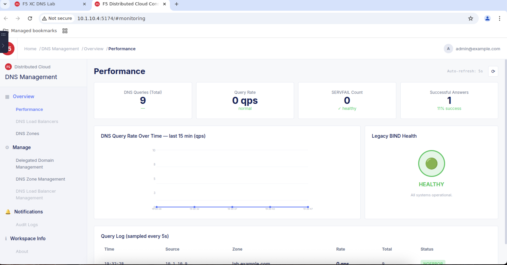

# F5 Distributed Cloud DNS - Lab 2: Attack Mitigation

## 📋 Lab Information

| Item | Details |
|------|---------|
| **Lab Name** | Lab 2 — Attack Mitigation |
| **Lab Objective** | XC DNS doesn't just serve DNS — it absorbs DDoS attacks. Watch a live flood get mitigated in real time |
| **Duration** | ~25 minutes |
| **Prerequisites** | Lab 1 completed (or pre-prepared environment) |

---

## 🎯 Lab Objective

> XC DNS doesn't just serve DNS — it absorbs DDoS attacks. Watch a live flood get mitigated in real time.

---

## 📝 Lab Instructions

### Step 1: Healthy Baseline - Monitor Baseline

Before we simulate an attack, let's confirm Legacy BIND is serving DNS normally.

1. Click on **"Healthy Baseline"** in the progress bar or **"Monitor baseline"** in the left navigation (highlighted in the red box).

2. You will see **STEP 1 OF 6 - HEALTHY BASELINE** with instructions:
   - Use the **DIY Test** tab to start a continuous DNS monitor in the Kasm terminal
   - Also open the **XC Console Performance Dashboard** in a separate tab and **keep it visible** (don't minimize) — it will show you real-time query statistics as the lab progresses

3. Click the **"Check DNS Baseline"** button (highlighted in the red box) to verify the baseline.


---

### Step 2: Action Complete - Baseline Verified

After checking the baseline, you will see the **"Action Complete"** message (highlighted in the red box) showing:

- API response received (baseline)
- Querying Legacy BIND at 10.1.10.7
- app.lab.example.com → 10.1.10.4 via Legacy BIND
- Response time: < 5ms
- DNS baseline: HEALTHY ✓


#### View XC Console Performance Dashboard

Open the **XC Console Performance Dashboard** in a separate browser tab to monitor DNS performance in real-time:

1. Click on the **F5 Distributed Cloud Console** tab or open the Performance Dashboard URL.

2. You will see the **Performance** dashboard showing:
   - **DNS Queries (Total):** 9
   - **Query Rate:** 0 qps (normal)
   - **SERVFAIL Count:** 0 (healthy)
   - **Successful Answers:** 1 (11% success)

3. **DNS Query Rate Over Time** — Graph showing query rate over the last 15 minutes

4. **Legacy BIND Health** — Shows **HEALTHY** status with green indicator (All systems operational)

5. **Query Log** — Shows recent DNS queries with Time, Source, Zone, Rate, Total, and Status

> **💡 Tip:** Keep this dashboard open throughout the lab to observe how DNS metrics change during the DDoS attack and mitigation phases.



---

### Step 3: Explore Network Diagram

Click on the **"Network Diagram"** tab (highlighted in the red box) to view the baseline topology:

**DDOS ATTACK & MITIGATION FLOW:**
- **CLIENT VM** (10.1.10.9) Legitimate → DNS query → **LEGACY BIND** (10.1.10.7) → A record → **APP SERVER** (10.1.10.4)
- Normal operation — Client queries Legacy BIND at 10.1.10.7


---

### Step 4: Hints & Context

Click on the **"Hints & Context"** tab (highlighted in the red box) to understand:

**What just happened?**
- We confirmed that Legacy BIND at 10.1.10.7 is responding normally to DNS queries. The continuous monitor you start in the DIY test will show a steady stream of successful responses — this is your visual baseline.

**Why does this matter?**

**Want to go deeper?**


---

### Step 5: DIY Test - Start Monitoring

Click on the **"DIY Test"** tab (highlighted in the red box) to start continuous monitoring:

Run these commands from the **Kasm desktop terminal** to independently verify what just happened. Click to copy:


💡 **Tip:** Open a terminal in the Kasm desktop (right-click → Terminal) and paste these commands to verify results independently.


---

### Step 6: Launch DNS Flood - Trigger Attack

Now we'll simulate a DDoS attack targeting the Legacy BIND server.

1. Click on **"Trigger attack"** in the left navigation or **"Launch DNS Flood"** in the progress bar (highlighted in the red box).

2. You will see **STEP 2 OF 6 - LAUNCH DNS FLOOD** with instructions:
   - A DNS DDoS flood attack is now targeting Legacy BIND at 10.1.10.7. Watch your DNS monitor from Step 1 — you should see responses start to time out or disappear as the attack overwhelms the server.

3. Click the **"Launch DNS DDoS Attack"** button (highlighted in the red box) to start the attack.


---

### Step 7: Action Complete - Attack Launched

After launching the attack, you will see the **"Action Complete"** message showing:

- API response received (launch_attack)
- DNS DDoS attack launched - targeting 10.1.10.7:53


---

### Step 8: Action Complete - DNS Service Degraded

The attack continues and you will see the full attack log:

- [00:00:00] - API response received (launch_attack)
- [00:01:03] ⚡ DNS DDoS attack launched - targeting 10.1.10.7:53
- [00:02:06] ⚠ Attack volume: thousands of queries per second
- [00:03:09] ⚠ Legacy BIND: response capacity overwhelmed
- [00:04:12] ⚠ Legitimate queries: timing out
- [00:05:15] ⚠ DNS SERVICE DEGRADED


---

### Step 9: Network Diagram - DDoS Attack

Click on the **"Network Diagram"** tab (highlighted in the red box) to view the attack topology:

**DDOS ATTACK & MITIGATION FLOW:**
- **CLIENT VM** (10.1.10.9) Legitimate → timeout ✗ → **LEGACY BIND** (10.1.10.7) → overwhelmed ✗ → **APP SERVER** (10.1.10.4)
- **DDoS FLOOD dnsperf** Attacking → flood traffic → **LEGACY BIND** (10.1.10.7)

> DDoS flood targeting 10.1.10.7 — Legacy BIND overwhelmed, DNS failing.


---

### Step 10: Hints & Context - Attack

Click on the **"Hints & Context"** tab (highlighted in the red box) to understand:

**What just happened?**
- We started a DNS flood attack that sends DDoS attack traffic overloading the Legacy DNS. Under the sustained volume, Legacy BIND's response capacity is exhausted — legitimate queries start timing out or returning SERVFAIL.

**Why does this matter?**

**Want to go deeper?**


---

### Step 11: DIY Test - Check Timeouts

Click on the **"DIY Test"** tab (highlighted in the red box) to verify the attack impact:

**DIY Testing** — Run these commands from the **Kasm desktop terminal** to independently verify what just happened. Click to copy:

1. **Check your DNS monitor from Step 1 — should show timeouts**
   ```
   echo "Switch to the terminal where you ran the DNS monitor from Step 1.
   You should see TIMEOUT or empty responses appearing.
   This proves the DDoS flood is overwhelming Legacy BIND."
   ```

2. **Try a single dig query — notice the slow response or timeout**
   ```
   time dig @10.1.10.7 app.lab.example.com A +short +timeout=3 +tries=1
   ```

💡 **Tip:** Open a terminal in the Kasm desktop (right-click → Terminal) and paste these commands to verify results independently.


---

### Step 12: Check Monitoring - Observe Impact

Now let's observe the impact of the DDoS attack on the DNS service.

1. Click on **"Check monitoring"** in the left navigation or **"Observe Impact"** in the progress bar (highlighted in the red box).

2. You will see **STEP 3 OF 6 - OBSERVE IMPACT** with instructions to check the monitoring status.


---

### Step 13: Action Complete - View XC Console Performance Dashboard

After the action is complete, open the **XC Console Performance Dashboard** to monitor the status at F5 XC.

1. Click on the XC Console Performance Dashboard tab or link to view real-time statistics.
2. Keep this dashboard visible to observe query statistics as the attack progresses.


---

### Step 14: XC Console - DDoS Attack Detected

When viewing the XC Console Performance Dashboard, you will see that **XC can detect that DNS is currently under DDoS Attack**.

- The dashboard shows increased query volume indicating attack traffic
- XC DNS is actively monitoring and can identify the DDoS attack in real-time
- Query statistics spike dramatically during the attack


---

### Step 15: Network Diagram - Check Monitoring

Click on the **"Network Diagram"** tab (highlighted in the red box) to view the current attack status:

**DDOS ATTACK & MITIGATION FLOW:**
- Shows the DDoS attack traffic overwhelming Legacy BIND
- Client requests are timing out
- DNS service is degraded


---

### Step 16: Hints & Context - Check Monitoring

Click on the **"Hints & Context"** tab (highlighted in the red box) to understand:

**What just happened?**
- The DNS flood attack has overwhelmed Legacy BIND's capacity to respond to legitimate queries.

**Why does this matter?**

**Want to go deeper?**


---

### Step 17: DIY Test - Check Monitoring

Click on the **"DIY Test"** tab (highlighted in the red box) to verify the attack impact independently:

**DIY Testing** — Run these commands from the **Kasm desktop terminal** to independently verify what just happened. Click to copy.

💡 **Tip:** Open a terminal in the Kasm desktop (right-click → Terminal) and paste these commands to verify results independently.


---

### Step 18: Absorb Attack - Mitigate with XC DNS

Now we'll use F5 XC DNS to absorb the DDoS attack and restore DNS service.

1. Click on **"Absorb attack"** in the left navigation or **"Mitigate with XC DNS"** in the progress bar (highlighted in the red box).

2. You will see **STEP 4 OF 6 - MITIGATE WITH XC DNS** with instructions:
   - XC DNS can absorb massive query volumes that would overwhelm traditional DNS infrastructure.
   - Enable XC DNS to take over and mitigate the attack.

3. Click the action button to enable XC DNS protection.


---

### Step 19: Action Complete - Absorb Attack

After enabling XC DNS protection, you will see the **"Action Complete"** message showing:

- XC DNS is now absorbing the DDoS attack traffic
- Legitimate queries are being processed normally
- Attack traffic is being filtered and mitigated


---

### Step 20: Network Diagram - Absorb Attack

Click on the **"Network Diagram"** tab (highlighted in the red box) to view the mitigation topology:

**DDOS ATTACK & MITIGATION FLOW:**
- **CLIENT VM** (10.1.10.9) Legitimate → **XC DNS** → A record → **APP SERVER** (10.1.10.4)
- **DDoS FLOOD dnsperf** Attacking → **XC DNS** absorbs attack traffic
- XC DNS filters malicious traffic and allows legitimate queries through

> XC DNS is now absorbing the DDoS attack — legitimate DNS queries are restored.


---

### Step 21: Hints & Context - Absorb Attack

Click on the **"Hints & Context"** tab (highlighted in the red box) to understand:

**What just happened?**
- XC DNS has taken over DNS resolution and is absorbing the DDoS attack traffic. The massive query volume that overwhelmed Legacy BIND is now being handled by F5's globally distributed DNS infrastructure.

**Why does this matter?**
- XC DNS provides DDoS protection by design, with the capacity to handle millions of queries per second.

**Want to go deeper?**


---

### Step 22: Verify Mitigation - Observe Recovery

Now let's verify that XC DNS has successfully mitigated the attack and DNS service is restored.

1. Click on **"Verify mitigation"** in the left navigation or **"Observe Recovery"** in the progress bar (highlighted in the red box).

2. You will see **STEP 5 OF 6 - OBSERVE RECOVERY** with instructions:
   - Check your DNS monitor from Step 1. The flood is still running, but now it's hitting XC DNS instead of Legacy BIND. XC DNS absorbs the attack traffic while serving legitimate queries normally. Your monitor should show responses returning.

3. Click the **"Verify DNS Recovery"** button to confirm DNS service is restored.


---

### Step 23: Action Complete - Verify Mitigation

After verifying, you will see the **"Action Complete"** message showing:

- Action done! See below: Network Diagram, Hints & Context (read all hint cards)
- [00:00:00] - API response received (verify_recovery)
- [00:01:03] ⚡ XC DNS now primary - absorbing all queries
- [00:02:06] ⚡ DDoS flood: still active, now hitting XC DNS
- [00:03:09] ✓ XC DNS: serving legitimate queries normally
- [00:04:12] ✓ DNS RECOVERY - XC DNS absorbing attack


---

### Step 24: Network Diagram - Verify Mitigation

Click on the **"Network Diagram"** tab (highlighted in the red box) to view the recovery topology:

**DDOS ATTACK & MITIGATION FLOW:**
- **CLIENT VM** (10.1.10.9) Legitimate → **XC DNS** → A record → **APP SERVER** (10.1.10.4) ✓
- **DDoS FLOOD dnsperf** Attacking → **XC DNS** absorbs attack traffic ✓
- XC DNS successfully absorbs attack while serving legitimate queries

> XC DNS is absorbing the DDoS attack — legitimate DNS queries are restored and working normally.


---

### Step 25: Hints & Context - Verify Mitigation

Click on the **"Hints & Context"** tab (highlighted in the red box) to understand:

**What just happened?**
- XC DNS is now handling all DNS queries. The DDoS attack is still running, but XC DNS's massive global capacity absorbs it without breaking a sweat. Your continuous monitor now shows successful responses again.

**Why does this matter?**
- Traditional DNS infrastructure can be overwhelmed by DDoS attacks. XC DNS provides built-in DDoS protection with global anycast infrastructure.

**Want to go deeper?**


---

### Step 26: DIY Test - Verify Mitigation

Click on the **"DIY Test"** tab (highlighted in the red box) to verify the recovery independently:

**DIY Testing** — Run these commands from the **Kasm desktop terminal** to independently verify what just happened. Click to copy.

1. **Check your DNS monitor from Step 1 — should show responses returning**
2. **Query XC DNS directly to verify it's serving legitimate queries**

💡 **Tip:** Open a terminal in the Kasm desktop (right-click → Terminal) and paste these commands to verify results independently.


---

### Step 27: Exposure Risk - Attacker Adapts

Now let's understand the remaining exposure risk even after XC DNS mitigation.

1. Click on **"Attacker Adapts"** in the progress bar (highlighted in the red box).

2. You will see **STEP 6 OF 6 - ATTACKER ADAPTS** with instructions:
   - The DDoS flood has been mitigated — but Legacy BIND at 10.1.10.7 is still publicly reachable. A sophisticated attacker could discover it through DNS history tools or network scans. The origin DNS server remains exposed.

3. Click the **"Acknowledge Exposure Risk"** button to understand the risk.


---

### Step 28: Action Complete - Exposure Risk

After the simulation, you will see the **"Action Complete"** message showing:

- The attacker has discovered the origin DNS IP (10.1.10.7) is still reachable
- A sophisticated attacker could bypass XC DNS and attack the origin directly
- This demonstrates why hiding the origin (Lab 3) is important


---

### Step 29: Network Diagram - Exposure Risk

Click on the **"Network Diagram"** tab (highlighted in the red box) to view the exposure risk:

**DDOS ATTACK & MITIGATION FLOW:**
- Shows that even with XC DNS protection, the origin DNS server (Legacy BIND) is still exposed
- Attacker can potentially discover and directly target the origin IP
- This highlights the need for Hidden Primary DNS (Lab 3)


---

### Step 30: Hints & Context - Exposure Risk

Click on the **"Hints & Context"** tab (highlighted in the red box) to understand:

**What just happened?**
- Even though XC DNS is absorbing the attack, the origin DNS server is still publicly accessible. An attacker could use DNS history tools or network scanning to discover the origin IP and attack it directly.

**Why does this matter?**
- Complete protection requires hiding the origin server (Hidden Primary architecture in Lab 3).

**Want to go deeper?**


---

### Step 31: DIY Test - Exposure Risk

Click on the **"DIY Test"** tab (highlighted in the red box) to verify the exposure risk:

**DIY Testing** — Run these commands from the **Kasm desktop terminal** to independently verify what just happened. Click to copy.

1. **Test if origin DNS is still reachable directly**
2. **Demonstrate that attacker could bypass XC DNS**

💡 **Tip:** Open a terminal in the Kasm desktop (right-click → Terminal) and paste these commands to verify results independently.


---

### Step 32: DIY Test - Wrap Up

Final wrap-up commands to complete the lab:

**DIY Testing** — Run these final commands to wrap up Lab 2.


---

### Step 33: Before & After - Lab 2 Complete

Congratulations! You have completed **Lab 2 — Attack Mitigation**.

**BEFORE & AFTER**

Review how XC DNS absorbed a live DDoS attack — and what remains exposed.

| BEFORE XC DNS | AFTER XC DNS (DDOS ABSORBING) |
|---------------|-------------------------------|
| DNS server directly exposed to DDoS floods | ✓ XC DNS absorbs DDoS traffic on the attacked IP |
| Attack = immediate service degradation | ✓ Legitimate queries served normally during attack |
| Single server, limited capacity | ✓ Distributed infrastructure, massive capacity |
| IP change is reactive, temporary fix | ✓ Sub-second mitigation (IP swap, no TTL wait) |
| Attacker can rediscover the new IP | ⚠ Origin DNS still exposed — Lab 3 fixes this |

**🎯 LAB 2 KEY TAKEAWAY**
> "XC DNS absorbed a DDoS flood in real time by taking over the attacked IP — but the origin DNS server is still reachable. Changing the IP buys time; hiding the origin (Lab 3) eliminates the risk."

**📝 SELF-REVIEW QUESTIONS**
1. What happened to DNS resolution when the DDoS flood hit Legacy BIND directly?
2. How did moving the attacked IP to XC DNS restore DNS service while the attack continued?
3. Why is changing the origin DNS IP a temporary fix? What tools could an attacker use to find the new IP?
4. What would a permanent solution look like? (Hint: Lab 3)

**Next Steps:**
- Click **"Start Lab 3 — Hidden Primary DNS"** to continue
- Or click **"Back to Lab Overview"** to review


---

## 🧭 Navigation Guide

Use the **Navigation Menu** on the left side to access:

**NAVIGATION:**
- **Overview** - View lab overview

**LABS:**
- **Lab 1 — DNS Availability** (Completed)
- **Lab 2 — Attack Mitigation** (Active)
  - Monitor baseline ✓
  - Trigger attack
  - Check monitoring
  - Absorb attack
  - Verify mitigation
  - Exposure risk
- **Lab 3 — Hidden Primary** (Locked)

---

## 📚 Additional Resources

**Tabs Available in Lab Interface:**

| Tab | Description |
|-----|-------------|
| **Scenario** | Explains the current scenario |
| **Network Diagram** | Shows network topology |
| **Hints & Context** | Provides hints and context |
| **DIY Test** | Self-testing section |

---

## ⏱️ Estimated Time

- **Lab 2 - Attack Mitigation:** ~25 minutes

---

## 📞 Support

If you encounter any issues during the lab, please contact your instructor.

---

*Lab Guide Version 1.0*  
*Created for F5 Distributed Cloud DNS Training*